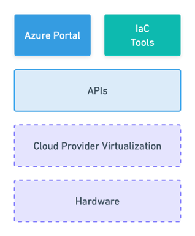
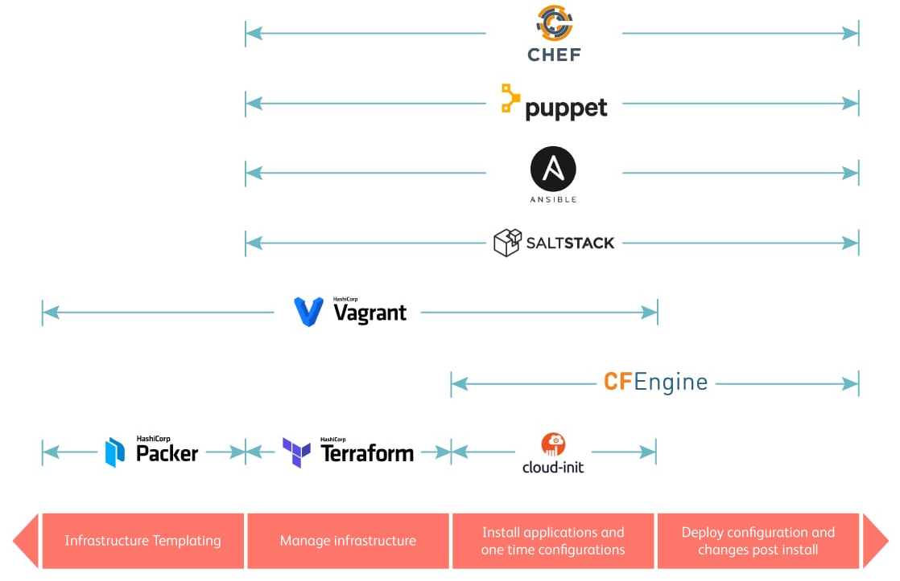
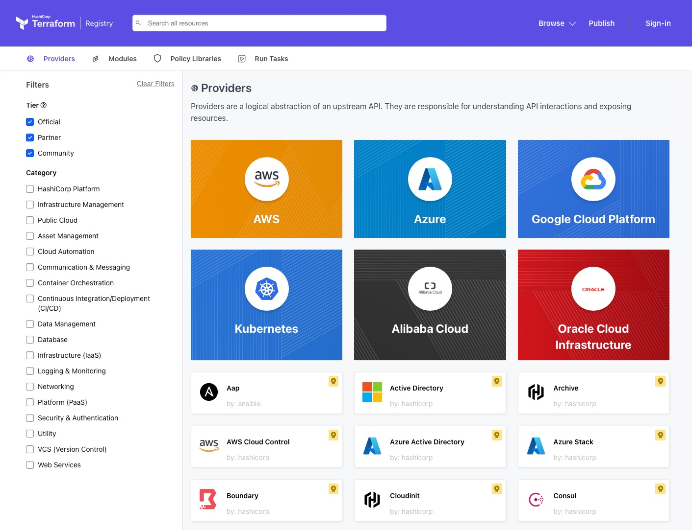

<!--
_class: title
-->

<div class="columns title-grid">
  <div>
    <h1>Infrastructure as Code</h1>
    <h2>Terraform & IaC</h2>
  </div>
  <div>
    
  </div>
</div>

---

# Agenda

- Grundkonzepte von Cloud, IaC und Terraform
- Warum IaC: Vorteile, Risiken, Anders denken
- Abgrenzung von Infrastruktur vs. Applikation: Was gehört wohin?

---

# Was ist Infrastructure as Code

**"[...] Infrastructure-as-Code (IaC) ist die Verwaltung von Infrastruktur (Netzwerken, virtuellen Computern, Lastenausgleichsmodulen und der Verbindungstopologie) in einem beschreibenden Modell. [...]"**
[Quelle](https://docs.microsoft.com/de-de/devops/deliver/what-is-infrastructure-as-code)

---

# Software defined Infrastructure

<div class="columns-text-and-image">
  <div>

- Cloud Provider sind nur über APIs zugänglich
- Cloud Ressourcen werden über APIs verwaltet
- Provider stellen SDKs, CLIs und Portale zur Verfügung, die APIs abstrahieren
- Infrastruktur wird über Code definiert, der APIs aufruft

  </div>

<div>



</div>
</div>

---

# Warum nutzen wir IaC?

- **Reproduzierbarkeit**: Umgebungen sind jederzeit neu erzeugbar (Dev/Test/Prod werden vergleichbarer)
- **Weniger Fehler**: weniger Klickpfade, weniger "vergessene" Einstellungen
- **Nachvollziehbarkeit**: Änderungen über Git/PRs (Review, Audit-Trail, Rollback)
- **Software-Prinzipien**: Tests, CI/CD, Security-Scans und Policy-as-Code sind möglich

---

# Anwendungsbereiche von IaC



---

# Was für Arten gibt es?

- Prozedurale Sprache - Wie erreiche ich den Zielzustand
- Deklarative Sprache - Was ist der Zielzustand

### Deklarativ vs. prozedural

<center>

  | Deklarativ                          | Prozedural                           |
  |-------------------------------------|--------------------------------------|
  | Zielzustand is sichtbar             | Zielzustand ist bedingt sichtbar     |
  | Abweichungen sind einfach erkennbar | Aktueller Zustand ist nicht sichtbar |
  | Wiederverwendbar                    | Bedingt wiederverwendbar             |

</center>

---

# Vor- & Nachteile von deklarativem IaC

| Vorteile                                            | Nachteile                                                |
|-----------------------------------------------------|----------------------------------------------------------|
| Transparente Infrastruktur</br> => Risikovermeidung | Manuelle Konfigurationen<br />können alles kaputt machen |
| Klarer Soll-Zustand                                 | Höherer Aufwand bei Konzeption & Umsetzung               |
| Drift Erkennung möglich                  | Know how über Cloudprovider APIs hilfreich               |

---

# Was gibt es für deklarative IaC Programme?

- AWS Cloud Formation
- Azure Resource Manager
- Google Cloud Deployment Manager
- Pulumi
- Terraform
- ...

---

# Was ist Terraform

- Entwickelt von der Firma HashiCorp _(Übernahme durch IBM in 2025)_
- Released im Juli 2014 - `1.0` Release am 08.06.2021
- Deklarativer IaC
- Plattform unabhängig (Azure, AWS, vSphere)
- Unterstützt Hybrid Cloud Infrastruktur
- Unveränderbare Infrastruktur
- kein Agent
- kein Master Server

---

# Funktionen von Terraform

- Integration diverser Plattformen über Provider
- Abhängigkeitsgraph
- Ausführungsplan
- Inkrementelle Veränderungen

---

# Von Schneeflocken zu verlässlichen Systemen

**Snowflake** ❄ = manuelle Änderungen führen zu einzigartigen, nicht reproduzierbaren Umgebungen
**Pets** 🐶 = wie Snowflakes, aber mit emotionalem Anhang ("Don't touch my pet!")
**Cattle** 🏅 = austauschbare, reproduzierbare Einheiten, die bei Bedarf ersetzt werden können

---

# Warum Änderungen nur über IaC?

**Config Drift** = Ist-Zustand weicht vom Code ab (z.B. Änderung im Portal/CLI/Hotfix).

- `terraform plan` zeigt plötzlich unerwartete Diffs
- Änderungen werden schwer reproduzierbar (**Snowflake-Umgebungen**)
- Debugging wird langsam: _Was ist wirklich live?_
- Risiko für Security/Compliance, weil Änderungen außerhalb von Reviews passieren

**Prinzip:** "Ändere die Quelle (IaC), nicht das Ziel (Portal)."

---

# Drift verhindern & erkennen

- **Trennung**: Infrastruktur-Änderungen über IaC, App-Änderungen über CI/CD
- **Verhindern**: Schreibrechte im Portal einschränken, CI/CD für IaC
- **Notfälle**: Break-glass nur temporär (z.B. PIM/JIT), nachziehen im IaC
- **Erkennen**: PR-Checks mit `terraform plan`, ggf. regelmäßige Drift-Checks
- **Beheben**: Drift bewusst in Code übernehmen _oder_ per IaC wieder auf Soll-Zustand zurückführen

---

# Trennung von Infrastruktur & Applikation

<div class="columns">
  <div>
    <h2>Platform IaC (Terraform)</h2>
    <ul>
      <li>Azure Ressourcen Verwaltung</li>
      <li>Azure Berechtigungsverwaltung</li>
    </ul>
  </div>
  <div>
    <h2>Application CI/CD</h2>
    <ul>
      <li>Application code and dependencies</li>
      <li>Application configuration</li>
    </ul>
  </div>
</div>

---

<h1>Terraform Code</h1>
<div class="columns-text-and-image">
  <div>

- HashiCorp Configuration Language (HCL)<br />_Domain Specific Language (DSL) für mehrere Produkte von HashiCorp_
- Dateiendungen von Terraform: `.tf`, `.tfvars`, `.tfbackend`

  </div>

  <div>

  Definition in Blöcken, z.B.:

  ```hcl
  terraform {}
  provider {}
  resource {}
  data {}
  module {}
  locals {}
  variable {}
  output {}
  ```

  </div>

</div>

---

# Terraform Ressourcen

Struktur:

```hcl
resource "provider_resource" "terraform_id" {
  # Properties
}
```

<br />
Beispiel:

```hcl
resource "azurerm_resource_group" "example" {
  name     = "example-resource-group"
  location = "West Europe"
}
```

---

# Terraform Data Sources

- Ermöglichen Zugriff auf bestehende Ressourcen
- Nützlich für Ressourcen, die nicht von Terraform verwaltet werden

<br />
Beispiel:

```hcl
data "azurerm_resource_group" "example" {
  name = "example-resource-group"
}
```

---

# Variables & Locals

<div class="columns-text-and-image">
  <div>

  <h4>Variables</h4>

    - Typisierung möglich: `string`, `number`, `bool`, `list`, `map`, *etc.*
    - Standardwerte & Validierung möglich
    - Können bei Modulen übergeben werden

    ```hcl
    variable "example"{
      type        = string
      description = "An example variable"
      default     = "foo"
    }
    ```

  </div>

  <div>

  <h4>Locals</h4>

    - Lokale Variablen, nur im aktuellen Modul
    - Können nicht von außen gesetzt werden
    - Keine Typisierung, Validierung oder Standardwerte

    ```hcl
    locals {
      example = "foo"
    }
    ```

  </div>

</div>

---

# Terraform Module

- Wiederverwendbare Code-Bausteine
- Kapseln Komplexität
- Können von Terraform Registry oder selbst erstellt sein
<br />

Beispiel:

```hcl
module "example" {
  source = "path/to/module"
  # Module-Inputs
}
```

---

# Terraform Registry

<div class="columns-text-and-image">
  <div>

- Provider für diverse Plattformen
- Super dokumentation über Provider, Ressourcen, Datasources, ...
- Module zur Wiederverwendung von Code
- Sowohl offiziele als auch Community Angebote
- <https://registry.terraform.io>

  </div>

<div>



</div>
</div>

---

# Terraform State

<div class="columns-text-and-image">
  <div>

- Infrastruktur nach letzem `terraform apply`
- Standardmäßig lokal in der Datei `terraform.tfstate`
- Sollte in einem Remote Backend gespeichert werden
- Locking des States bei Remote Backends notwendig
- Kann sensible Daten enthalten (z.B Passwörter)

  </div>

  <div>

  

  </div>

</div>

---

# Terraform flow

1. `terraform init` - Initialisiert Terraform, lädt Provider und Module
2. `terraform plan` - Zeigt geplante Änderungen an der Infrastruktur
3. `terraform apply` - Führt die geplanten Änderungen aus
4. `terraform destroy` - Zerstört die Infrastruktur

---

# Terraform lernen und üben

- Hashicorp Tutorials - <https://developer.hashicorp.com/terraform/tutorials>
- Terraform Community Best Practices - <https://www.terraform-best-practices.com>

---

# Praxis Beispiele ⚒️

---

<!--
_class: title
-->

<div class="columns title-grid">
  <div>
    <h1>Q&A</h1>
    <h3>Fragen ? ---> Fragen ! </h3>
  </div>
  <div>
    
  </div>
</div>

---

# Quellen

- <https://docs.microsoft.com/de-de/devops/deliver/what-is-infrastructure-as-code>
- <https://learn.microsoft.com/devops/deliver/what-is-infrastructure-as-code>
- <https://learn.microsoft.com/azure/cloud-adoption-framework/ready/considerations/infrastructure-as-code-updates>
- <https://www.computerweekly.com/de/ratgeber/Infrastructure-as-Code-Acht-beliebte-Tools-im-Vergleich>
- <https://www.redhat.com/de/topics/automation/what-is-infrastructure-as-code-iac>
