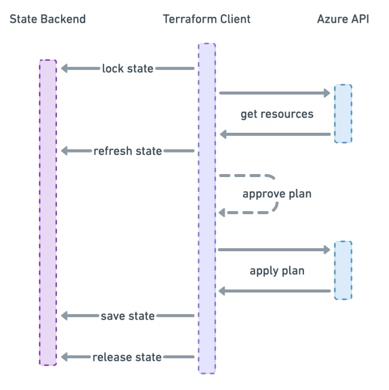

<style>
  img[alt~="center"] {
    display: block;
    margin: 0 auto;
  }
  .columns {
    display: grid;
    grid-template-columns: repeat(2, minmax(0, 1fr));
    gap: 1rem;
  }
</style>

# Infrastructure as Code

---

# Was ist Infrastructure as Code

**"[...] Infrastructure-as-Code (IaC) ist die Verwaltung von Infrastruktur (Netzwerken, virtuellen Computern, Lastenausgleichsmodulen und der Verbindungstopologie) in einem beschreibenden Modell. [...]"**
[Quelle](https://docs.microsoft.com/de-de/devops/deliver/what-is-infrastructure-as-code)

---

# Was für Arten gibt es?

- Prozedurale Sprache - Wie erreiche ich den Zielzustand
- Deklarative Sprache - Was ist der Zielzustand

## Deklarativ vs. prozedural

| Deklarativ                     | Prozedural                           |
| ------------------------------ | ------------------------------------ |
| Zielzustand is sichtbar        | Zielzustand ist bedingt sichtbar     |
| Aktueller Zustand ist sichtbar | Aktueller Zustand ist nicht sichtbar |
| Wiederverwendbar               | Bedingt wiederverwendbar             |

---

# IaC Bereiche


---

# Vor- & Nachteile von deklarativem IaC

| Vorteile                                                                            | Nachteile                                                        |
| ----------------------------------------------------------------------------------- | ---------------------------------------------------------------- |
| Transparente Infrastruktur</br> => Risikovermeidung                                 | Manuelle Konfigurationseingriffe<br />können alles kaputt machen |
| Wiederholbar                                                                        | Hoher Aufwand bei Konzeption & Umsetzung                         |
| Automatisierung der Infrastruktur                                                   | Know how über Cloudprovider APIs                                 |
| Vorteile von Softwareentwicklung</br>(Testbar, Versionierbar, Deployment Pipelines) |                                                                  |

---

# Was gibt es für deklarative IaC Programme?

- AWS Cloud Formation
- Azure Resource Manager
- Google Cloud Deployment Manager
- Pulumi
- Terraform
- ...

---

# Was ist Terraform

- Entwickelt von der Firma HashiCorp
- Released im Juli 2014 - 1.0 Release am 08.06.2021
- Deklarativer IaC
- Plattform unabhängig (Azure, AWS, vSphere)
- Unterstützt Hybrid Cloud Infrastruktur
- Unveränderbare Infrastruktur
- kein Agent
- kein Master Server

---

# Funktionen von Terraform

- Integration von Plattformen über Provider
- Abhängigkeitsgraph
- Ausführungplan
- Inkrementelle Veränderungen

---

# Terraform Code

<div class="columns">
<div>

- HashiCorp Configuration Language (HCL)
- Domain Specific Language (DSL) für mehrere Produkte von HashiCorp
- Dateiendungen von Terraform: `.tf`, `.tfvars`, `.tfbackend`

</div>
<div>

Definition in Blöcken, z.B.:

```hcl
terraform {}
provider {}
resource {}
data {}
locals {}
variable {}
output {}
```

</div>
</div>

---

# Terraform Registry

<div class="columns">
<div>

- Provider zur Anbindung an Cloud Provider
- Module zur Wiederverwendung von Code
- Für offizelle und Community Entwicklungen
- <https://registry.terraform.io>

</div>
<div>


</div>
</div>

---

# Terraform State

<div class="columns">
<div>

- Speichert den aktuellen Zustand der Infrastruktur
- Standardmäßig lokal in der Datei `terraform.tfstate`
- Kann in einem Remote Backend gespeichert werden
- Locking des States bei Remote Backends
- Kann sensible Daten enthalten (z.B. Passwörter)

</div>
<div>



</div>
</div>

---

# Variables & Locals

<div class="columns">
<div>

#### Variables

- Typisierung möglich: `string`, `number`, `bool`, `list`, `map`, _etc._
- Standardwerte & Validierung möglich
- Können bei Modulen übergeben werden

```hcl
variable "example"{
  type        = string
  description = "An example variable"
  default     = "foo"
}
```

</div>
<div>

#### Locals

- Lokale Variablen, nur im aktuellen Modul
- Können nicht von außen gesetzt werden
- Keine Typisierung, Validierung oder Standardwerte

```hcl
locals {
  example = "foo"
}
```

</div>
</div>

---

# Code Beispiele

---

# Ende

### Fragen ? -> Fragen

---

# Quellen

- <https://docs.microsoft.com/de-de/devops/deliver/what-is-infrastructure-as-code>
- <https://www.computerweekly.com/de/ratgeber/Infrastructure-as-Code-Acht-beliebte-Tools-im-Vergleich>
- <https://www.redhat.com/de/topics/automation/what-is-infrastructure-as-code-iac>
