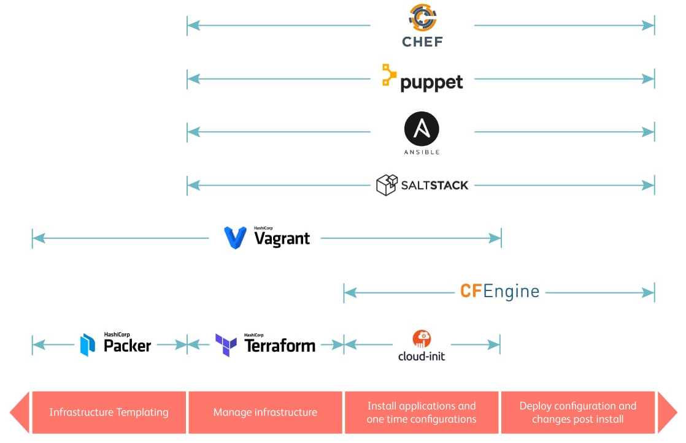

<style>
img[alt~="center"] {
  display: block;
  margin: 0 auto;
}
</style>

# Infrastructure as Code

---

# Was ist Infrastructure as Code

**"[...] Infrastructure-as-Code (IaC) ist die Verwaltung von Infrastruktur (Netzwerken, virtuellen Computern, Lastenausgleichsmodulen und der Verbindungstopologie) in einem beschreibenden Modell. [...]"**
[Quelle](https://docs.microsoft.com/de-de/devops/deliver/what-is-infrastructure-as-code)

---

# Was für Arten gibt es?

- Prozedurale Sprache - Wie erreiche ich den Zielzustand
- Deklarative Sprache - Was ist der Zielzustand

## Deklarativ vs. prozedural

| Deklarativ                     | Prozedural                           |
| ------------------------------ | ------------------------------------ |
| Zielzustand is sichtbar        | Zielzustand ist bedingt sichtbar     |
| Aktueller Zustand ist sichtbar | Aktueller Zustand ist nicht sichtbar |
| Wiederverwendbar               | Bedingt wiederverwendbar             |

---

# IaC Bereiche



---

# Vor- & Nachteile von deklarativem IaC

| Vorteile                                                                            | Nachteile                                                        |
| ----------------------------------------------------------------------------------- | ---------------------------------------------------------------- |
| Transparente Infrastruktur</br> => Risikovermeidung                                 | Manuelle Konfigurationseingriffe<br />können alles kaputt machen |
| Wiederholbar / Skalierbar                                                           | Hoher Aufwand bei Konzeption & Umsetzung                         |
| Automatisierung der Infrastruktur                                                   | Know how über Cloudprovider APIs                                 |
| Vorteile von Softwareentwicklung</br>(Testbar, Versionierbar, Deployment Pipelines) |                                                                  |

---

# Was gibt es für deklarative IaC Programme?

- AWS Cloud Formation
- Azure Resource Manager
- Google Cloud Deployment Manager
- Pulumi
- Terraform
- ...

---

# Was ist Terraform

- Entwickelt von der Firma HashiCorp
- Released im Juli 2014 - 1.0 Release am 08.06.2021
- Deklarativer IaC
- Plattform unabhängig (Azure, AWS, vSphere)
- Unterstützt Hybrid Cloud Infrastruktur

---

# Funktionen von Terraform

- Integration von Plattformen über Provider
- Abhängigkeitsgraph
- Ausführungplan
- Inkrementelle Veränderungen

---

# Beispiel: Einen Cloud Provider verwenden

```
# Einrichten des AWS Cloud providers
provider "aws" {
  region  = "eu-central-1"
  profile = "default"
}
```

---

# Beispiel: Ressourcen anlegen

Erstellen einer virtuellen Maschine.

```
resource "aws_instance" "server" {
  ami           = "ami-043097594a7df80ec"     # Snapshot
  instance_type = "t3.micro"
}
```

---

# Beispiel: Externe Daten abfragen

```
# Daten über das Netzwerk vom Cloud Provider abrufen
data "aws_subnet_ids" "subnets" {
  vpc_id = "vpc-0c7ec20e383d6470e"
}

# Erstellen eines Netzwerkinterfaces für die VM in dem ersten abgerufenen virtuellen Subnetz.
resource "aws_network_interface" "nic" {
  subnet_id = sort(data.aws_subnet_ids.subnets.ids)[0]      # Verweis auf das erste abgerufenden Subnetz
}

# Erstellen einer virtuellen Maschine.
resource "aws_instance" "server" {
  ami           = "ami-043097594a7df80ec"                   # Snapshot
  instance_type = "t3.micro"

  network_interface {
    network_interface_id = aws_network_interface.nic.id     # Verweis auf erstellte  Netzwerkinterface
    device_index         = 0
  }
}
```

---

# Beispiel: Abhängigkeiten zwischen Ressourcen

```
resource "aws_vpc" "network" {
  cidr_block = "172.16.0.0/16"
}

resource "aws_subnet" "subnet" {
  vpc_id            = aws_vpc.network.id                    # Verweis auf erstelltes Netzwerk
  cidr_block        = "172.16.1.0/24"
  availability_zone = "eu-central-1"
}

resource "aws_network_interface" "nic" {
  subnet_id   = aws_subnet.subnet.id                        # Verweis auf erstelltes Subnetz
  private_ips = ["172.16.1.100"]
}

resource "aws_instance" "server" {
  ami           = "ami-043097594a7df80ec"                   # Snapshot
  instance_type = "t3.micro"

  network_interface {
    network_interface_id = aws_network_interface.nic.id     # Verweis auf erstellte  Netzwerkinterface
    device_index         = 0
  }
}
```

---

# Beispiel: Code wiederholen

```
# Lokale variablen für Terraform
locals {
  number_vms = 2                                            # Anzahl der zu erstellenden VMs
}

# Erstellen mehrerer Netzwerkinterfaces für jede VM in dem virtuellen Subnetz.
resource "aws_network_interface" "nic" {
  count     = local.number_vms
  subnet_id = "subnet-01e96318745f57bb9"
}

# Erstellen mehrerer virtuellen Maschine.
resource "aws_instance" "server" {
  count         = local.number_vms                          # Block X mal wiederholen
  ami           = "ami-043097594a7df80ec" # Snapshot
  instance_type = "t3.micro"

  network_interface {
    # Verweis auf das jeweilige erstellte Netzwerkinterface
    network_interface_id = aws_network_interface.nic[count.index].id
    device_index         = 0
  }
}
```

---

# Terraform Module

- Eine Art Container für zusammen verwendete Ressourcen.
- Wiederverwenden von Code
- Anpassung von Parametern durch inputvariablen
- Ermöglichte das definieren von einfachen Standards

---

# Ein kleines Beispielmodul

```
# Input variablen zur Anpassung der Ressourcen
variable "instanz_typ" {
  type        = string
  description = "(Optional) Größe der Instanz."
  default     = "t3.micro"
}

# Erstellen einer virtuellen Maschine.
resource "aws_instance" "server" {
  ami           = "ami-043097594a7df80ec"
  instance_type = var.instanz_typ           # Anrufen der Variable
}

# Ausgewählte Informationen der erstellten Ressourcen zurückgeben
output "id" {
  description = "ID"
  value       = aws_instance.server.id
}

output "private_ipv4" {
  description = "Private IPv4"
  value       = aws_instance.server.private_ip
}
```

---

# Verwenden des Moduls

```
module "vm" {
  source      = "<Weg zum Modul>" # Als quelle können auch repositories und registries verwendet werden.

  # Variablen des Moduls anpassen.
  instanz_typ = "t2.nano"
}

# Modulausgaben ausgeben

output "vm_id" {
  description = "ID der VM"
  value       = module.vm.id
}
```

---

# Ende

### Fragen ? -> Fragen !!

### Zeit für einen Austausch.

---

# Quellen

- https://docs.microsoft.com/de-de/devops/deliver/what-is-infrastructure-as-code
- https://www.computerweekly.com/de/ratgeber/Infrastructure-as-Code-Acht-beliebte-Tools-im-Vergleich
- https://www.redhat.com/de/topics/automation/what-is-infrastructure-as-code-iac
